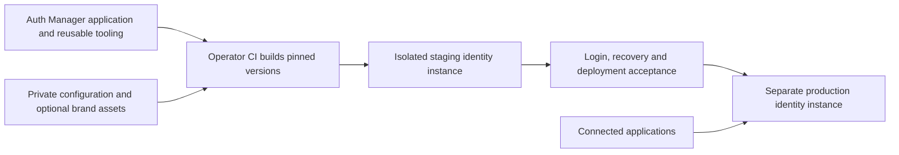

# Deploying an independently branded instance

Auth Manager is a shared identity application, not a central repository of every
customer's infrastructure. Each instance has its own directory, application
registry, credentials and runtime. An operator's deployment repository selects
reviewed versions and supplies configuration and optional branding.

## How the pieces fit

| Shared in this repository | Owned by the deployment operator |
| --- | --- |
| Login, account/security and provider-admin screens | Identity hostnames and environment policy |
| Default light/dark stylesheet and branding hooks | Approved logos, colors, fonts and mail identity |
| Application registry and delegated-access contract | OAuth clients, application registrations and adapter configuration |
| Reusable release tooling and synthetic regression tests | CI orchestration, credentials, network access and approvals |
| Lifecycle and session-verification contracts | Consumer adoption, emergency access and operational recovery |

The existing upstream deployment jobs operate configured installations. A new
operator should use its own deployment jobs rather than add its host credentials
to those jobs. A cloud build service or another trusted CI executor can run the
same versioned tooling.

## Default UI and optional branding

The default application includes both light and dark themes. No branding bundle
is required to use it. A custom bundle supplies approved local logos/favicon and
theme-token overrides; it does not replace the base stylesheet, authentication
forms or account-management behavior. Preserve accessible labels, errors and
contrast in both modes.

Brand assets live in the operator's private source or asset store. Build them into
the release after the application assets are compiled. See
[deployment branding](deployment-branding.md) for runtime keys, accepted paths,
mail behavior and the asset-packaging interface available in your tooling version.
Customer assets and hostnames must not appear in public examples or fixtures.

## Prepare staging and production separately

For example, an operator might select `id.example.test` for production and
`id-staging.example.test` for staging. These are documentation placeholders.

Provision an isolated runtime for each environment: an unprivileged identity
principal, database and database user, application key, OAuth signing pair,
persistent storage, host-only session cookie, cache/queue namespace, PHP worker
pool, background workers and scheduler. Configure mail delivery, backups and
recovery access. Do not copy application credentials or share its storage.

Configure DNS and verified origin TLS before exposing the login service. With a
reverse proxy, restrict trusted forwarding headers to the actual trusted proxy
addresses. A public HTTPS connection alone does not prove the proxy uses verified
HTTPS to its origin.

Use an explicit WebAuthn RP ID and allowed HTTPS origin. The RP ID identifies the
credential scope and need not equal the login hostname, but it must satisfy the
browser's RP-ID rules. Choose it before enrollment. Existing credentials cannot
be relabeled for a different RP ID; provide fresh enrollment and a tested alternate
sign-in/recovery path when changing that boundary. Keep staging enrollment separate.

## Pin application and deployment tooling independently

The application revision controls the code being deployed. The engine revision
controls packaging/activation and its safety checks. Pin and verify both before
executing code from either checkout; pin CI actions and build images as well.

Using separate pins lets an older application release use current deployment
fixes, and supports releases created before reusable tooling was added. The
remote worker uses the immutable engine copy uploaded for that deployment, never
a script through the mutable `current` application pointer. Follow the engine
version's CLI, policy and status contract; do not silently mix incompatible
versions. The engine guide accompanies versions that include the isolated-release
tooling. Older versions require their documented deployment process.

## Build, activate and verify

1. Verify the environment opt-in, target policy, application/tooling revisions and
   schema compatibility. Keep production enablement separate from staging.
2. Install locked dependencies, build application assets and optionally package
   branding. Include both the source revision and a unique deployment identifier.
   Package no environment files, persistent storage or signing keys.
3. Upload through pinned SSH trust to the isolated release area. Validate the
   target, archive, persistent paths, public traversal permissions and runtime
   configuration before activation.
4. Run reviewed backward-compatible migrations and prepare caches before switching
   the active release. The previous code may still be serving during migrations.
   Split schema additions from dependent reads when compatibility requires it.
5. Atomically activate the candidate. Verify public health, the exact deployment
   identifier, assets and dedicated workers before recording success. A source SHA
   alone cannot distinguish two deployments of the same code with different assets.
6. On post-activation failure, restore the previous code pointer and workers and
   verify their health. Record failure even when recovery succeeds. Code rollback
   does not undo migrations, identity deletion or other database changes.

Activation must survive loss of its initiating SSH connection. The CI job observes
durable, deployment-bound status; a lost acknowledgement is not evidence of either
success or failure. Inspect status and the active release before retrying an
unobserved outcome. Keep operational recovery for host failure and forced process
termination separate from ordinary code rollback.

The generic engine and its tests are maintained together; operator repositories
should invoke a pinned upstream copy instead of copying and diverging the scripts.
Preserve only tests of operator-specific workflow gates and branding inputs there.

## Deploying identity is not migrating application users

A healthy identity service does not create application accounts or transfer
authorization. The provider-admin user screen owns names, emails, credentials,
disable/delete operations and coarse OAuth client grants. The instance registry
owns trusted application launch destinations. The central application-access
screen delegates fine-grained changes to each application's API.

Each consumer must implement subject binding, applicable profile refresh, session
invalidation, deletion reconciliation and any delegated authorization adapter.
Verify alternate sign-in and local emergency access, preserve application-specific
invitation/approval flows, and then retire duplicated identity controls and their
old mutation endpoints. Do not infer completed integration from a successful
provider deployment.

See [account ownership and cutover](account-management-contract.md),
[directory profiles](directory-profiles.md), [application registry](application-registry.md),
[delegated access](delegated-access-transport.md),
[identity status](identity-status.md) and [deletion lifecycle](identity-deletion.md).
